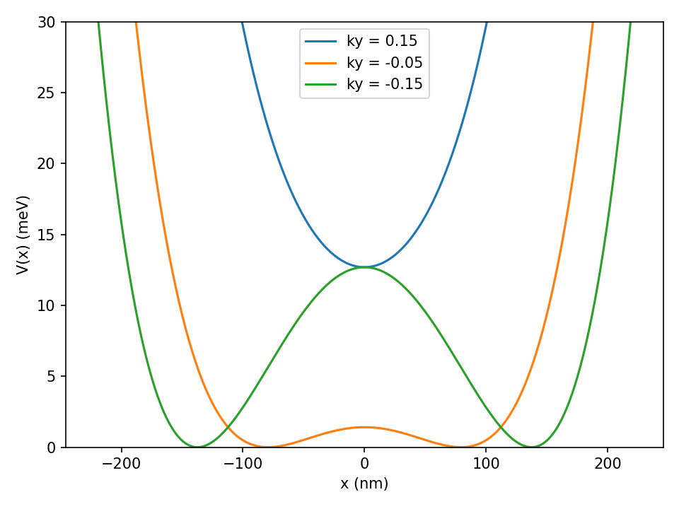
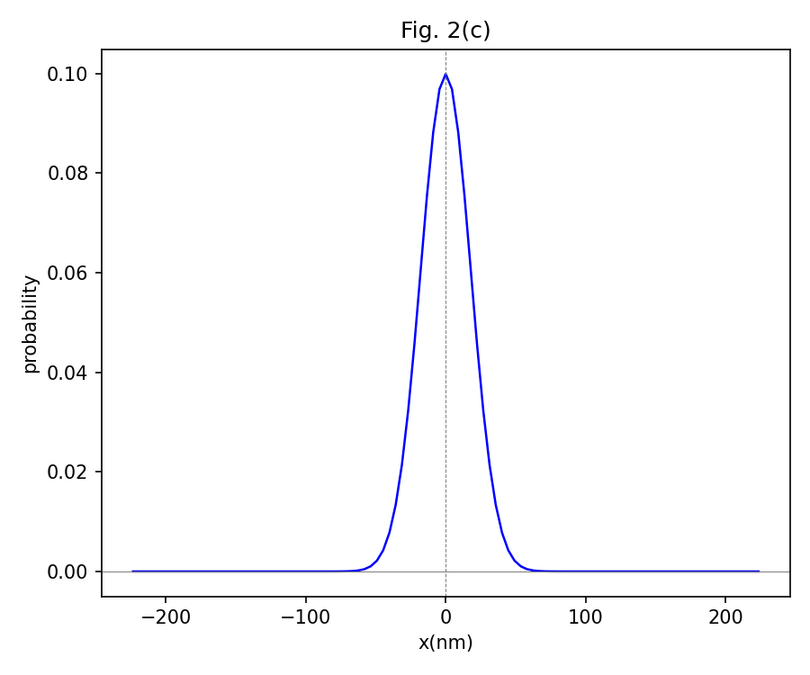
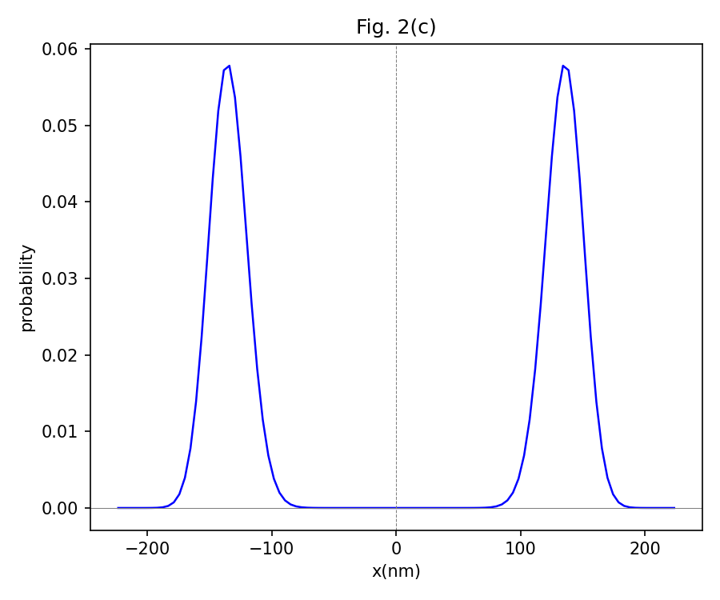
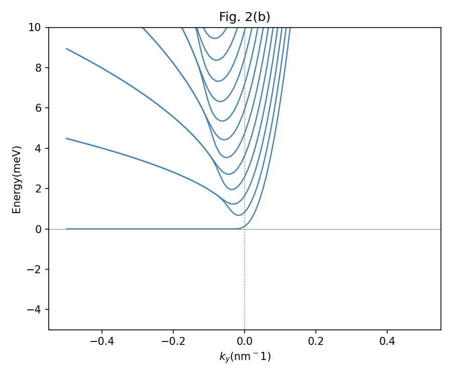
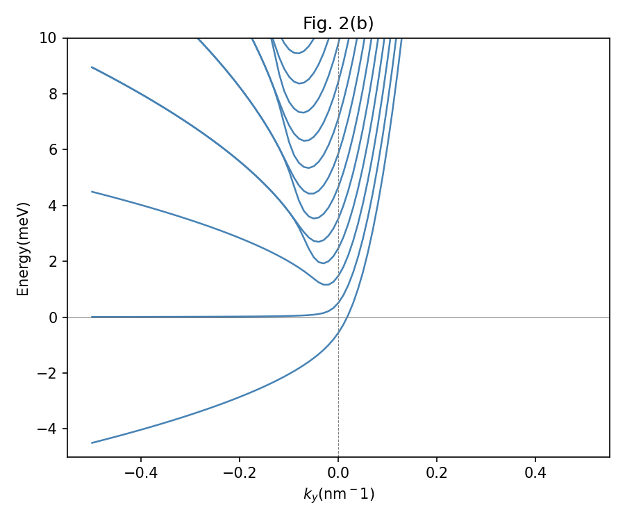
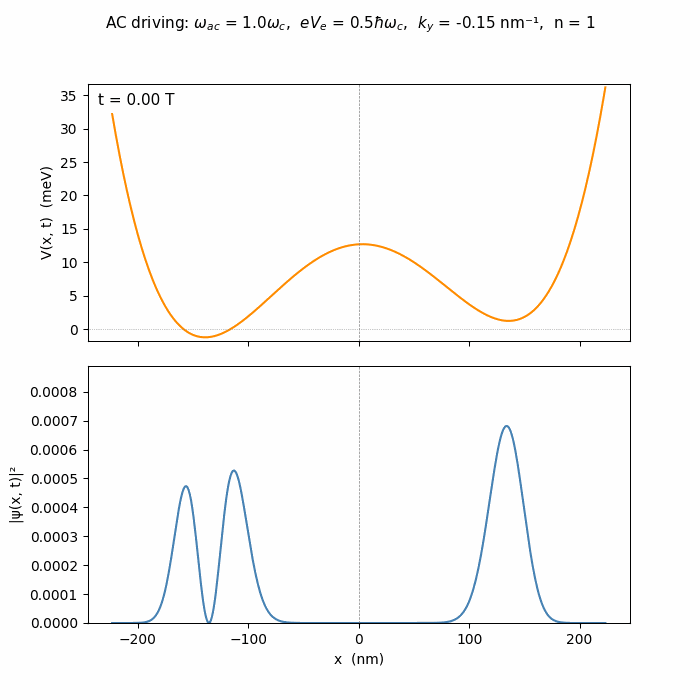
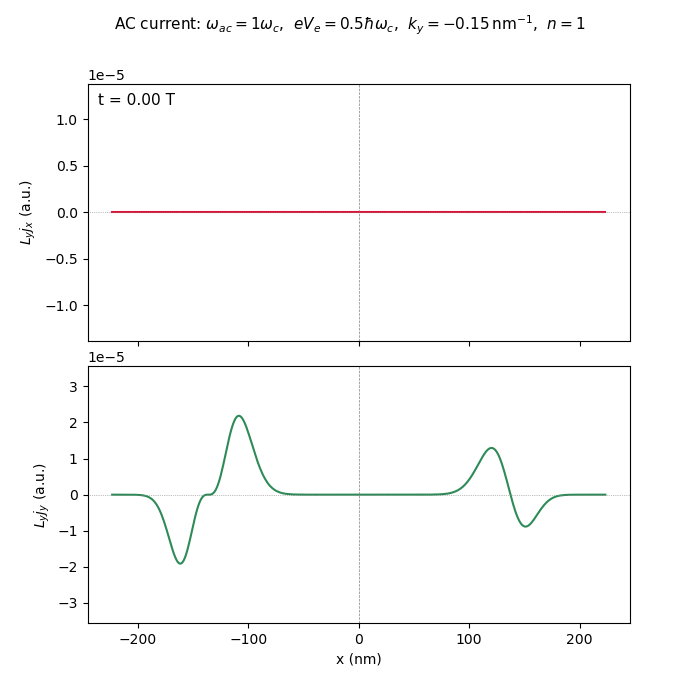

# Nonuniform-B 2DEG Time-Domain Simulator

This repository simulates a two-dimensional electron gas (2DEG) in a linearly
nonuniform magnetic field with a transverse static or AC electric drive. The
code reduces the 2D problem to independent fixed-$k_y$ one-dimensional
channels, solves the resulting quartic Hamiltonian in a simple-harmonic-
oscillator (SHO) basis, and propagates driven states with a sixth-order
commutator-free time-evolution method.

The static part reproduces the electrically switchable flat-band/Landau-level
structure discussed in [arXiv:2601.05064](https://arxiv.org/abs/2601.05064).
The time-dependent and current-density parts are documented in
[`non_BTD.pdf`](non_BTD.pdf), whose source is [`non_BTD.md`](non_BTD.md).

## Physics Model

The 2DEG lies in the $x$-$y$ plane. The field profile and gauge used by the
program are

$$
\mathbf B(x)=\frac{B_0 x}{L}\hat{\mathbf z},\qquad
\mathbf E(t)=\frac{V_e(t)}{L}\hat{\mathbf x},
$$

$$
\mathbf A(x)=\frac{B_0 x^2}{2L}\hat{\mathbf y},\qquad
\phi(x,t)=-\frac{V_e(t)}{L}x .
$$

Because the Hamiltonian is translationally invariant in $y$, each channel

$$
\Psi(x,y,t)=L_y^{-1/2}e^{ik_y y}\psi_{k_y}(x,t)
$$

evolves independently under

$$
H_{k_y}(t)=
\frac{p_x^2}{2m^*}
+\frac{1}{2m^*}
\left(\hbar k_y+\frac{eB_0x^2}{2L}\right)^2
+\frac{eV_e(t)}{L}x .
$$

In code this becomes the polynomial matrix

$$
H=c_{p^2}p_x^2+c_xx+c_{x^2}x^2+c_{x^4}x^4+c_0I,
$$

assembled by [`hamiltonian.py`](hamiltonian.py) from SHO-basis operators in
[`basis.py`](basis.py). Parameters are stored in [`params.py`](params.py) in
Hartree atomic units, with GaAs/AlGaAs effective mass and conversion factors
to meV and nm for plotting.

## What The Code Computes

- Static effective potentials $V_{k_y}(x)$ for positive and negative $k_y$.
- Energy bands $E_n(k_y)$ under different transverse electric-field strengths.
- SHO-basis eigenstates and probability densities.
- AC-driven probability-density evolution.
- Gauge-covariant line-current densities $L_y j_x$ and $L_y j_y$ for each
  fixed-$k_y$ channel.
- Numerical checks for Lanczos diagonalization, time propagation, current
  conservation, and analytic driven-oscillator benchmarks.

## Representative Outputs

Static potential and spectrum:




Probability densities for opposite signs of $k_y$:





Electric-field tuning:





At selected values of $eV_e/\hbar\omega_c$, the lowest bands flatten. In this
parameter set, $eV_e=0.5\hbar\omega_c$ and $1.5\hbar\omega_c$ flatten the
first and second bands, respectively.

AC-driven probability and current animations:





## Installation

Use Python 3.11 or newer. The runtime dependencies are small:

```bash
pip install numpy scipy matplotlib pillow
```

`pillow` is needed only for saving GIF animations. The report can be rebuilt
from `non_BTD.md` with Marp if Marp is installed, but Marp is not required to
run the simulator or tests.

## Quick Start

Generate the main static figures:

```bash
python potential.py
python spectrum.py
python wave_function.py
```

Generate time-dependent animations:

```bash
python time_visualise.py
python current_visualise.py
```

Run the validation suite:

```bash
python -m unittest discover -s tests -v
```

Generate the report-specific figures used by `non_BTD.pdf`:

```bash
python generate_report_static_figures.py
python generate_report_time_figures.py
python generate_report_current_figures.py
```

## Numerical Methods

### Static Diagonalization

The static Hamiltonian is represented in an SHO basis. `basis.py` builds the
matrix elements of $x$, $x^2$, $x^4$, and $p_x^2$ analytically from ladder
operator identities. `spectrum.py` can use either dense diagonalization
(`scipy.linalg.eigh`) or Lanczos Ritz pairs from [`lanczos.py`](lanczos.py).

Typical tunable quantities are:

- `ky_array`: sampled $k_y$ values, displayed in nm$^{-1}$.
- `Ve`: electric potential scale, commonly set as `ne * hbar * w_c / e`.
- `nmax`: SHO basis size.
- `nlevel`: number of bands/eigenstates.
- `method`: `"dense"` or `"lanczos"`.

### Time Evolution

[`time_coeffs.py`](time_coeffs.py) implements two propagators:

- `midpoint_dense`: a dense midpoint exponential reference.
- `y6_2_lanczos`: the production sixth-order
  $\Upsilon_2^{[6]}$ commutator-free propagator described in
  [`method.pdf`](method.pdf) and explained in [`non_BTD.pdf`](non_BTD.pdf).

The production propagator samples the time-dependent Hamiltonian at three
Gauss-Legendre nodes, forms the required modified potentials, and applies four
matrix exponential actions with a Lanczos Krylov method. The default drive is

```python
Ve_t = Ve * cos(w_ac * t)
```

with defaults defined near the top of `time_coeffs.py`.

### Current Density

[`current.py`](current.py) computes the gauge-covariant electron charge
current for a fixed-$k_y$ channel. The returned quantities are line currents,
not full 2D densities:

$$
L_y j_x=-\frac{e\hbar}{m^*}\operatorname{Im}(\psi^*\partial_x\psi),
$$

$$
L_y j_y=-\frac{e}{m^*}
\left(\hbar k_y+\frac{eB_0x^2}{2L}\right)|\psi|^2 .
$$

The $A_y(x)$ term is essential: omitting it would compute a canonical-momentum
current instead of the physical mechanical current. The tests verify the
static band-slope/current relation, the driven Ehrenfest relation, and the
sampled charge-continuity equation.

## Validation

The tests are numerical validation models rather than only smoke tests.

| Test file | What it checks | Typical threshold |
| --- | --- | --- |
| [`tests/test_lanczos.py`](tests/test_lanczos.py) | Lanczos exponential actions and Ritz eigenpairs against dense references; production spectrum against dense diagonalization. | `1e-10` for small reference problems; `1e-8` Hartree for spectrum comparison. |
| [`tests/test_driven_sho.py`](tests/test_driven_sho.py) | A driven 1D harmonic oscillator against its analytic position and coherent-state solution. | `2e-3` relative position error; final infidelity below `1e-3`. |
| [`tests/test_current.py`](tests/test_current.py) | Gauge-covariant current in static and driven 2DEG states. | `2e-5` static current/band-slope mismatch; `7e-4` driven Ehrenfest mismatch; `1e-3` continuity residual. |

Additional visual validation scripts:

```bash
python tests/plot_driven_sho.py
python tests/plot_current_validation.py
```

These save validation plots under `figures/` and `tests/artifacts/`.

## Repository Map

| File | Role |
| --- | --- |
| [`params.py`](params.py) | Physical constants, effective mass, field scale, and unit conversions. |
| [`basis.py`](basis.py) | SHO matrix elements for $x$, $x^2$, $x^4$, and $p_x^2$. |
| [`hamiltonian.py`](hamiltonian.py) | Fixed-$k_y$ quartic Hamiltonian assembly. |
| [`potential.py`](potential.py) | Static effective-potential plotting. |
| [`spectrum.py`](spectrum.py) | Static band-structure calculation. |
| [`wave_function.py`](wave_function.py) | SHO-basis reconstruction and static probability-density plotting. |
| [`lanczos.py`](lanczos.py) | Lanczos eigenpair and exponential-action routines. |
| [`time_coeffs.py`](time_coeffs.py) | AC Hamiltonian, sixth-order propagation, and probability evolution. |
| [`time_visualise.py`](time_visualise.py) | Probability-density GIF generation. |
| [`current.py`](current.py) | Gauge-covariant current-density observables. |
| [`current_visualise.py`](current_visualise.py) | Current-density GIF generation. |
| [`generate_report_static_figures.py`](generate_report_static_figures.py) | Static figures for the report deck. |
| [`generate_report_time_figures.py`](generate_report_time_figures.py) | Time-propagator validation figure for the report deck. |
| [`generate_report_current_figures.py`](generate_report_current_figures.py) | Current-validation figures for the report deck. |
| [`non_BTD.md`](non_BTD.md), [`non_BTD.pdf`](non_BTD.pdf) | Full derivation/report: static model, time propagation, and current density. |
| [`method.pdf`](method.pdf) | Reference for the sixth-order commutator-free propagation scheme. |

## Notes And Limitations

- Most scripts expose parameters directly near the top of the file or inside
  the `if __name__ == "__main__"` block.
- Large `nmax`, dense diagonalization, or long GIF runs can be slow. Use the
  Lanczos path for larger basis sizes.
- The current implementation evolves one independent $k_y$ channel at a time.
- Ongoing work: high-order harmonic Hall-current generation under periodic
  driving.
