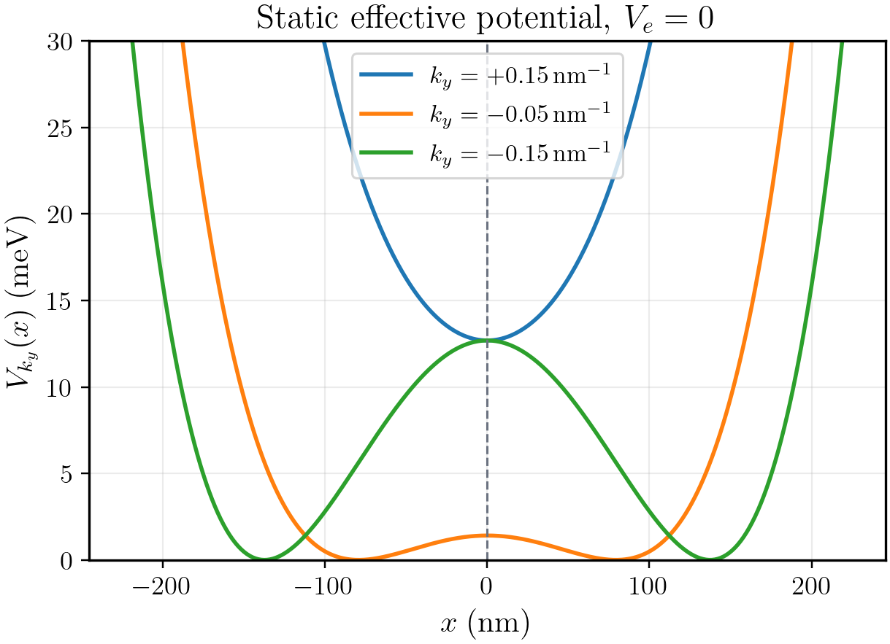
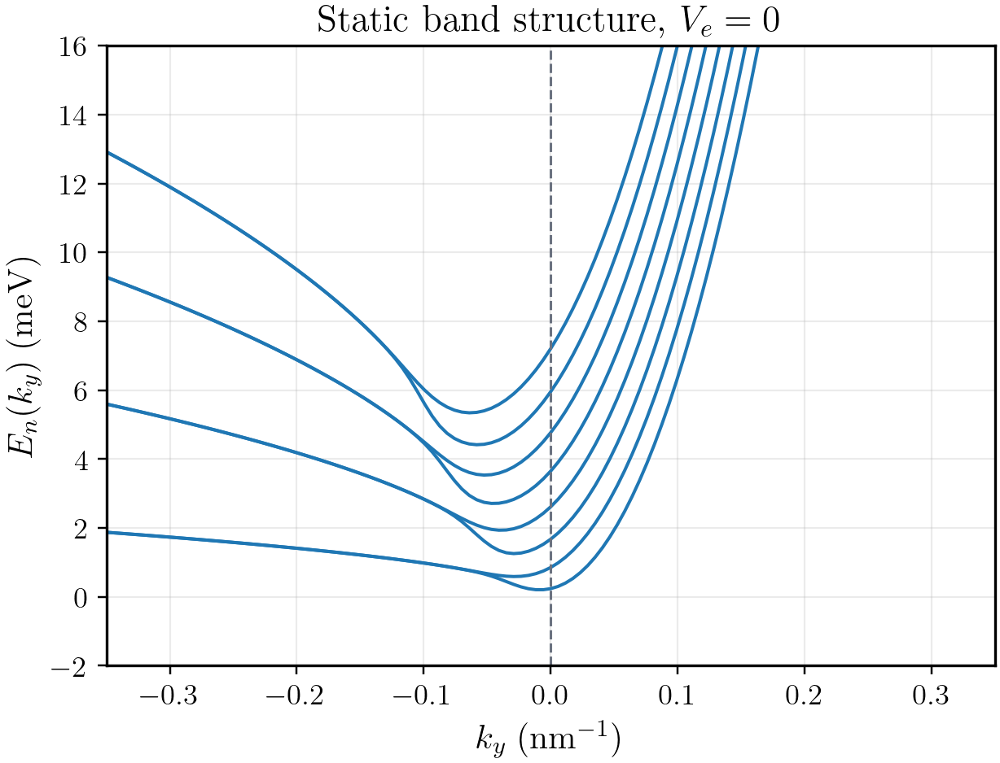
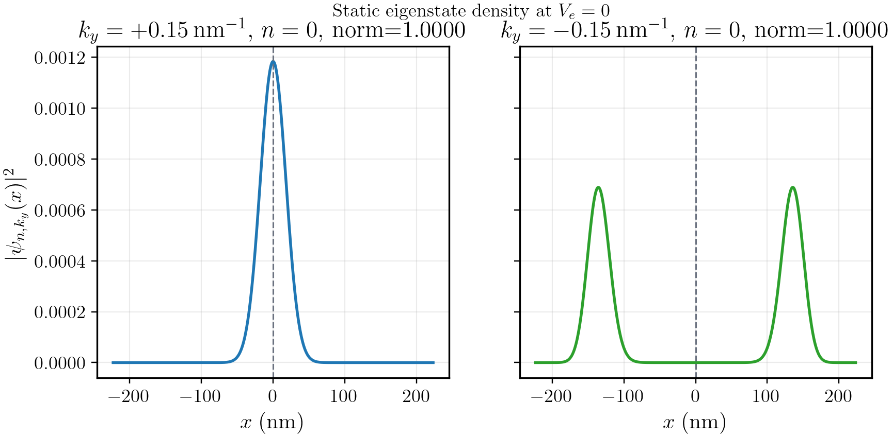
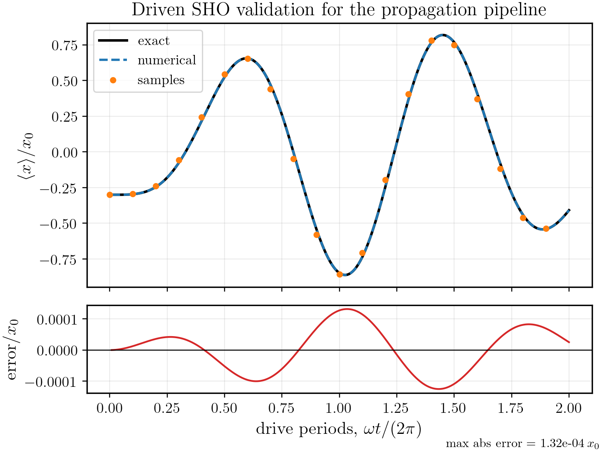
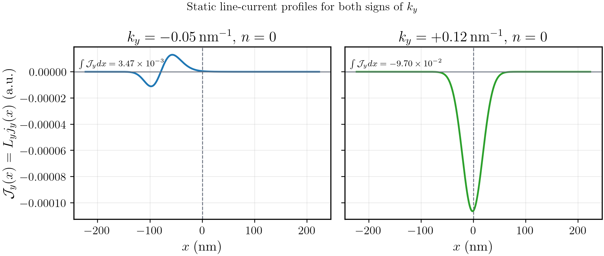
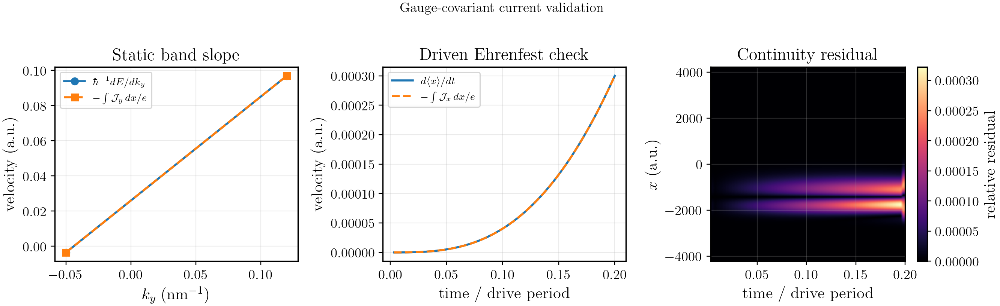

<!-- _class: title -->

# Time-Dependent Dynamics of a 2DEG in a Linearly Nonuniform Magnetic Field

## Static channel model, sixth-order time propagation, and gauge-covariant current

### Qiancan Chen (Jerry Chen)
### National Tsing Hua University

---

# Report chapters

1. **Review of the static model**
   - derive the $k_y$-resolved one-dimensional Hamiltonian;
   - explain the SHO-basis matrix calculation;
   - compare the potential topology for $k_y>0$ and $k_y<0$;
   - show band structure and wavefunction-density figures with full parameters.

2. **Time-evolution calculation method**
   - build the logic chain from TDSE to time-ordered propagator;
   - compare Dyson and Magnus representations of the propagator;
   - explain the $\alpha_1,\alpha_2,\alpha_3$ basis and $\Upsilon_2^{[6]}$;
   - connect every mathematical object to code and numerical parameters.

3. **Current-density calculation**
   - derive current from the gauge-covariant Schrodinger Lagrangian;
   - reduce it to a fixed-$k_y$ channel current;
   - explain the implementation and validation plots.

---

# Reproducibility files used in this report

All report-specific figures are regenerated by Python scripts kept in the repository:

| Purpose | Script | Output |
|---|---|---|
| Shared plot style | `report_plotsetting.py` | LaTeX labels, line widths, colors |
| Static potential, bands, densities | `generate_report_static_figures.py` | `figures/report/static_*.png` |
| Time-propagator validation | `generate_report_time_figures.py` | `figures/report/driven_sho_validation.png` |
| Current validation | `generate_report_current_figures.py` | `figures/report/current_validation.png` |

Run:

```bash
python generate_report_static_figures.py
python generate_report_time_figures.py
python generate_report_current_figures.py
```

---

<!-- _class: chapter -->

# Chapter 1

## Review of the static model

- Derive the Hamiltonian solved in each fixed-$k_y$ channel.
- Represent the Hamiltonian in a harmonic-oscillator basis.
- Compare the effective potential for $k_y>0$ and $k_y<0$.

---

# Chapter 1 objectives

This chapter establishes the static foundation used by the later time-dependent calculation.

1. Start from the two-dimensional electromagnetic Hamiltonian.
2. Use translation symmetry in $y$ to reduce it to independent $k_y$ channels.
3. Write the resulting one-dimensional Hamiltonian as a polynomial in $x$.
4. Explain the static SHO-basis diagonalization.
5. Interpret the potential and eigenstates for $k_y>0$ and $k_y<0$.
6. Show static band structure and probability-density figures.

---

# Fields, geometry, and gauge

The electron gas is confined to the $x$-$y$ plane.

$$
\mathbf B(x)=\frac{B_0x}{L}\hat{\mathbf z},
\qquad
\mathbf E(t)=\frac{V_e(t)}{L}\hat{\mathbf x}.
$$

Use the gauge

$$
\mathbf A(x)=A_y(x)\hat{\mathbf y}
=\frac{B_0x^2}{2L}\hat{\mathbf y},
\qquad
\phi(x,t)=-\frac{V_e(t)}{L}x.
$$

Check:

$$
\partial_x A_y=\frac{B_0x}{L},
\qquad
-\partial_x\phi=\frac{V_e(t)}{L}.
$$

---

# Full two-dimensional Hamiltonian

For an electron, $q=-e$ with $e>0$. Minimal coupling gives

$$
H(t)=\frac{1}{2m^*}\left[-i\hbar\nabla+e\mathbf A(x)\right]^2-e\phi(x,t).
$$

Substituting the gauge:

$$
H(t)=
\frac{p_x^2}{2m^*}
+
\frac{1}{2m^*}
\left(p_y+\frac{eB_0x^2}{2L}\right)^2
+
\frac{eV_e(t)}{L}x.
$$

<div class="warn">
The electric potential energy has a plus sign because $q\phi=-e\phi=+eV_ex/L$.
</div>

---

# Reduction to fixed-$k_y$ channels

There is no explicit $y$ in $H(t)$, so

$$
[H,p_y]=0.
$$

Therefore the wavefunction can be decomposed as

$$
\Psi(x,y,t)=\frac{e^{ik_yy}}{\sqrt{L_y}}\psi_{k_y}(x,t).
$$

Then

$$
p_y\Psi=\hbar k_y\Psi,
$$

and each $k_y$ evolves independently:

$$
i\hbar\partial_t\psi_{k_y}(x,t)
=H_{k_y}(t)\psi_{k_y}(x,t).
$$

---

# Effective one-dimensional Hamiltonian

Substitute $p_y\to\hbar k_y$:

$$
\boxed{
H_{k_y}(t)=
\frac{p_x^2}{2m^*}
+
\frac{1}{2m^*}
\left(
\hbar k_y+\frac{eB_0x^2}{2L}
\right)^2
+
\frac{eV_e(t)}{L}x.
}
$$

This is the Hamiltonian solved in the code.

It is:

- one-dimensional in $x$;
- quartic in position;
- parametrized by $k_y$;
- time-dependent only through the linear electric term.

---

# Polynomial form used by the program

Expanding the square:

$$
\begin{aligned}
H_{k_y}(t)=&
\frac{p_x^2}{2m^*}
+\frac{\hbar^2k_y^2}{2m^*}I
+\frac{\hbar k_yeB_0}{2m^*L}x^2\\
&+\frac{e^2B_0^2}{8m^*L^2}x^4
+\frac{eV_e(t)}{L}x.
\end{aligned}
$$

The five matrix coefficients in `hamiltonian.py` are:

```python
c_p2 = 1 / (2*m_star)
c_x  = e*Ve / L
c_x2 = hbar*ky*e*B0 / (2*m_star*L)
c_x4 = e**2*B0**2 / (8*m_star*L**2)
c_x0 = hbar**2*ky**2 / (2*m_star)
```

---

# Physical and numerical units

The repository uses atomic units internally.

| Quantity | Code variable | Value or conversion |
|---|---|---|
| $\hbar$ | `hbar` | $1$ a.u. |
| electron charge magnitude | `e` | $1$ a.u. |
| effective mass | `m_star` | $0.067m_e$ |
| field scale | `B0` | $1.65/(2.35\times10^5)$ a.u. |
| magnetic length scale | `L` | $16\pi^2$ nm converted to a.u. |
| energy output | `AU_TO_MEV` | a.u. $\to$ meV |
| length output | `AU_TO_NM` | a.u. $\to$ nm |

File: `params.py`.

---

# SHO-basis representation

The wavefunction is expanded in a simple harmonic oscillator basis:

$$
\psi(x)=\sum_{n=0}^{N_{\max}-1}c_n\varphi_n(x).
$$

Operators become matrices:

$$
x,\quad x^2,\quad x^4,\quad p_x^2.
$$

Then the static Hamiltonian becomes an $N_{\max}\times N_{\max}$ Hermitian matrix:

$$
H=c_{p^2}p^2+c_xx+c_{x^2}x^2+c_{x^4}x^4+c_0I.
$$

The matrix elements are built in `basis.py:operators_matrixize`.

---

# Static diagonalization workflow

For each selected $k_y$:

1. Build $H_{k_y}(V_e)$ using `build_H`.
2. Diagonalize it:

$$
H_{k_y}\mathbf c_n=E_n(k_y)\mathbf c_n.
$$

3. Convert energies to meV.
4. Reconstruct wavefunctions with

$$
\psi_{n,k_y}(x)=\sum_m c_{n,m}\varphi_m(x).
$$

5. Plot $|\psi_{n,k_y}(x)|^2$.

Main code paths:

- `spectrum.py:compute_spectrum`
- `wave_function.py:QHO_basis`
- `generate_report_static_figures.py`

---

# Static potential: stationary points

Set $V_e=0$ and define

$$
\alpha=\frac{eB_0}{2L}.
$$

Then

$$
V_0(x)=\frac{(\hbar k_y+\alpha x^2)^2}{2m^*}.
$$

Differentiate:

$$
\frac{dV_0}{dx}
=\frac{2\alpha x}{m^*}(\hbar k_y+\alpha x^2).
$$

Stationary points are

$$
x=0,
\qquad
x_\pm=\pm\sqrt{-\frac{\hbar k_y}{\alpha}}.
$$

The off-center points exist only when $k_y<0$.

---

# Static potential: $k_y>0$ versus $k_y<0$

At the central point,

$$
V_0''(0)=\frac{2\alpha\hbar k_y}{m^*}.
$$

<div class="cols">
<div class="box">

### $k_y>0$

$$
V_0''(0)>0.
$$

The only minimum is at $x=0$.

This produces an interface-localized state near the zero of $B(x)$.

</div>
<div class="box">

### $k_y<0$

$$
V_0''(0)<0.
$$

The central point is a local maximum.

Two minima appear at $x_\pm$.

</div>
</div>

---

# Static potential figure and parameters



Generated by:

```bash
python generate_report_static_figures.py
```

Parameters:

| Item | Value |
|---|---|
| electric potential | $V_e=0$ |
| plotted $k_y$ | $+0.15,-0.05,-0.15\;\mathrm{nm}^{-1}$ |
| $x$ range | $[-\sqrt2L,\sqrt2L]$ |
| output | `figures/report/static_potential.png` |

The labels and mathematical text use the shared report plot setting.

---

# Static band structure calculation

For the band structure, the calculation sweeps $k_y$:

$$
k_y\in[-0.35,0.35]\;\mathrm{nm}^{-1}.
$$

At every $k_y$, solve

$$
H_{k_y}\mathbf c_n=E_n(k_y)\mathbf c_n.
$$

Report parameters:

| Parameter | Value |
|---|---:|
| $V_e$ | $0$ |
| $N_{\max}$ | $221$ |
| number of $k_y$ points | $121$ |
| plotted bands | lowest $8$ |
| eigensolver | dense Hermitian diagonalization |
| script | `generate_report_static_figures.py` |

---

# Static band structure result



The spectrum is not a simple Landau-level ladder because the magnetic field is spatially nonuniform.

Interpretation:

- $k_y>0$: single-well states localized near $x=0$;
- $k_y<0$: double-well states centered near $x_\pm$;
- the continuous change in $k_y$ moves the effective guiding-center structure.

Output file:

```text
figures/report/static_spectrum_ve0.png
```

---

# Wavefunction-density calculation

For a chosen eigenvector $\mathbf c_n$:

$$
\psi_{n,k_y}(x)=\sum_{m=0}^{N_{\max}-1}c_{n,m}\varphi_m(x).
$$

Then

$$
\rho_{n,k_y}(x)=|\psi_{n,k_y}(x)|^2.
$$

Report parameters:

| Parameter | Value |
|---|---:|
| $V_e$ | $0$ |
| $k_y$ | $+0.15,-0.15\;\mathrm{nm}^{-1}$ |
| level | $n=0$ |
| $N_{\max}$ | $221$ |
| $x$ grid | $501$ points on $[-\sqrt2L,\sqrt2L]$ |

---

# Wavefunction-density result



The density plots directly show the potential-topology change:

- $k_y=+0.15\;\mathrm{nm}^{-1}$: central density peak.
- $k_y=-0.15\;\mathrm{nm}^{-1}$: two separated lobes.

The script also prints the numerical normalization:

$$
\int |\psi(x)|^2dx\simeq1.
$$

Output file:

```text
figures/report/static_density_ky_pm015.png
```

---

# Chapter 1 summary

The static model is now fully specified:

1. A two-dimensional electromagnetic Hamiltonian reduces to independent one-dimensional $k_y$ channels.
2. Each channel is a quartic oscillator plus a possible linear electric tilt.
3. The SHO basis turns $x,x^2,x^4,p^2$ into matrices.
4. $k_y>0$ gives a single central well; $k_y<0$ gives two off-center wells.
5. The static band structure and density plots are reproducible from preserved scripts.

---

<!-- _class: chapter -->

# Chapter 2

## Time-evolution calculation method

The goal is to explain the complete path from TDSE to the implemented $\Upsilon_2^{[6]}$ algorithm.

---

# Chapter 2 objectives

This chapter reports four calculation steps:

1. Time ordering follows from noncommuting Hamiltonians.
2. Dyson and Magnus give two representations of the same exact propagator.
3. Three Gauss-Legendre time nodes provide sixth-order time information.
4. The final $\Upsilon_2^{[6]}$ formula maps directly to `time_coeffs.py`.

The logic is not:

$$
\text{sample }H(t)\Rightarrow\text{exponentiate its average}.
$$

The correct logic is:

$$
\text{sample }H(t)
\Rightarrow
\text{reconstruct Magnus information}
\Rightarrow
\text{use a commutator-free product}.
$$

---

# Complete logic chain

$$
\boxed{\text{Need time evolution}}
$$

$$
\Downarrow
$$

$$
i\hbar\partial_t\psi(t)=H(t)\psi(t)
$$

$$
\Downarrow
$$

$$
U(t_n+\tau,t_n)
=
\mathcal T
\exp\left[
-\frac{i}{\hbar}
\int_{t_n}^{t_n+\tau}H(t)\,dt
\right]
$$

$$
\Downarrow
$$

$$
[H(t_1),H(t_2)]\ne0
\Rightarrow
\text{cannot only exponentiate averaged }H.
$$

---

# Complete logic chain continued

$$
\boxed{
U
=I+\int A(t_1)dt_1
+\int_{t_1>t_2}A(t_1)A(t_2)dt_1dt_2+\cdots
}
$$

Dyson expansion writes the time-ordered propagator as an ordered series.

$$
\Downarrow
$$

It is exact as an infinite series, but a finite truncation is not automatically unitary.

$$
\Downarrow
$$

Magnus rewrites the same propagator as one exponential:

$$
\boxed{U=e^\Omega}
$$

This form keeps the propagator unitary when $\Omega$ is truncated as an anti-Hermitian operator.

---

# Complete logic chain continued

$$
\Downarrow
$$

Need a sixth-order approximation $\Omega^{[6]}$.

$$
\Downarrow
$$

Need sixth-order accurate time information.

$$
\Downarrow
$$

Use three-point Gauss-Legendre quadrature.

$$
\Downarrow
$$

Map standard nodes on $[-1,1]$ to $[t_n,t_n+\tau]$.

$$
\Downarrow
$$

Compute $H_1,H_2,H_3$ at the three Gauss nodes.

---

# Complete logic chain continued

$$
\boxed{H_1,H_2,H_3}
$$

$$
\Downarrow
$$

Change basis to midpoint, slope, and curvature:

$$
\alpha_1,\alpha_2,\alpha_3.
$$

$$
\Downarrow
$$

Write the sixth-order Magnus expansion using $\alpha_j$.

$$
\Downarrow
$$

Replace the commutator-containing $e^{\Omega^{[6]}}$ by a product of ordinary exponentials.

$$
\Downarrow
$$

Obtain the implemented propagator:

$$
\boxed{\Upsilon_2^{[6]}}.
$$

---

# Time-dependent Hamiltonian split

For the AC calculation:

$$
V_e(t)=V_{\rm ac}\cos(\omega_{\rm ac}t).
$$

Write

$$
H(t)=T+V(t),
$$

with

$$
T=\frac{p_x^2}{2m^*},
$$

$$
V(t)=V_c(x;k_y)+f(t)V_f(x).
$$

Here

$$
f(t)=\cos(\omega_{\rm ac}t),
\qquad
V_f(x)=\frac{eV_{\rm ac}}{L}x.
$$

---

# Code for the Hamiltonian split

`time_coeffs.py:build_split_operators` constructs:

```python
kinetic = p2_mat / (2 * m_star)

static_potential = (
    (hbar**2 * ky**2 / (2 * m_star)) * np.eye(nmax_value)
    + (hbar * ky * e * B0 / (2 * m_star * L)) * x2_mat
    + (e**2 * B0**2 / (8 * m_star * L**2)) * x4_mat
)

drive_potential = (e * Ve / L) * x_mat
```

Then

```python
V(t) = static_potential + cos(w_ac*t) * drive_potential
```

This is the numerical realization of $H(t)=T+V_c+f(t)V_f$.

---

# Noncommutativity of the driven Hamiltonian

For the AC protocol,

$$
H(t)=H_0+f(t)V_f,
$$

where

$$
H_0=T+V_c.
$$

Then

$$
\begin{aligned}
[H(t_1),H(t_2)]
&=[H_0+f_1V_f,\;H_0+f_2V_f]\\
&=(f_2-f_1)[H_0,V_f].
\end{aligned}
$$

Since $V_f\propto x$ and $T\propto p_x^2$,

$$
[T,x]\ne0.
$$

So time ordering is physically meaningful.

---

# Magnus expansion

Define the anti-Hermitian operator

$$
A(t)=-\frac{i}{\hbar}H(t).
$$

The exact propagator is

$$
U(t_n+\tau,t_n)
=\mathcal T\exp\left[\int_{t_n}^{t_n+\tau}A(t)\,dt\right].
$$

Magnus rewrites it as

$$
\boxed{U=e^\Omega}.
$$

The first two terms are

$$
\Omega_1=\int A(t_1)\,dt_1,
$$

$$
\Omega_2=
\frac12\int_{t_1>t_2}[A(t_1),A(t_2)]\,dt_1dt_2.
$$

---

# Role of the Magnus expansion

Magnus does two useful things:

1. It keeps noncommutativity through nested commutators.
2. It preserves unitarity at every truncation order because $\Omega$ is anti-Hermitian.

If we only use

$$
\exp\left[-\frac{i}{\hbar}\int H(t)dt\right],
$$

we keep the average Hamiltonian but lose time-ordering corrections.

The sixth-order method must reproduce both:

- high-order time integral information;
- high-order commutator information.

---

# Three-point Gauss-Legendre quadrature

Gauss-Legendre quadrature first works on the standard interval $[-1,1]$.

The symbols $\xi_1,\xi_2,\xi_3$ are dimensionless sampling coordinates on this standard interval:

$$
\xi_1=-\sqrt{\frac35},
\qquad
\xi_2=0,
\qquad
\xi_3=+\sqrt{\frac35}.
$$

Interpretation:

- $\xi_2=0$ is the midpoint sample;
- $\xi_1$ and $\xi_3$ are symmetric side samples;
- the symmetry separates even-in-time and odd-in-time information around the midpoint.

The weights are

$$
w_1=w_3=\frac59,
\qquad
w_2=\frac89.
$$

This rule integrates polynomials through degree $5$ exactly.

After mapping to a time step, that gives the sixth-order time information needed for a local error $O(\tau^7)$.

---

# Mapping nodes to a time step

Map $\xi\in[-1,1]$ to $t\in[t_n,t_n+\tau]$:

$$
t=t_n+\frac{\tau}{2}(1+\xi).
$$

Define

$$
t_m=t_n+\frac{\tau}{2}.
$$

Then

$$
t=t_m+\frac{\tau}{2}\xi.
$$

Thus each dimensionless node $\xi_j$ becomes an actual Hamiltonian sampling time:

$$
t_j=t_m+\frac{\tau}{2}\xi_j.
$$

The side-node distance from the midpoint is

$$
\boxed{
\delta=\frac{\tau}{2}\sqrt{\frac35}
=\frac{\sqrt{15}}{10}\tau.
}
$$

---

# Three Hamiltonian samples

The three time nodes are

$$
c_1=\frac12-\frac{\sqrt{15}}{10},
\quad
c_2=\frac12,
\quad
c_3=\frac12+\frac{\sqrt{15}}{10}.
$$

Define

$$
t_j=t_n+c_j\tau,
\qquad
H_j=H(t_j)=T+V_j.
$$

In code:

```python
Y6_2_C = np.array([
    0.5 - np.sqrt(15) / 10,
    0.5,
    0.5 + np.sqrt(15) / 10,
])
```

---

# Gauss integral of the Hamiltonian

The quadrature gives

$$
\int_{t_n}^{t_n+\tau}H(t)\,dt
=
\tau\left(
\frac5{18}H_1+\frac49H_2+\frac5{18}H_3
\right)
+O(\tau^7).
$$

This is only the $\Omega_1$ part of Magnus:

$$
\Omega_1=-\frac{i}{\hbar}\int H(t)dt.
$$

<div class="warn">
Gauss-Legendre quadrature alone does not solve the time-ordering problem. The remaining terms in $\Omega$ are commutators.
</div>

---

# Change of basis: $\alpha_1,\alpha_2,\alpha_3$

The paper reorganizes $H_1,H_2,H_3$ into:

$$
\boxed{\alpha_1=\tau H_2,}
$$

$$
\boxed{\alpha_2=
\tau\frac{\sqrt{15}}{3}(H_3-H_1),}
$$

$$
\boxed{\alpha_3=
\tau\frac{10}{3}(H_3-2H_2+H_1).}
$$

This is not a new approximation.

It is a linear change of basis from raw time samples to midpoint-centered time information:

$$
\text{midpoint value},\quad
\text{time slope},\quad
\text{time curvature}.
$$

---

# Finite-difference content of the basis

Let

$$
H_j=H(t_m+s_j),
\qquad
s_1=-\delta,\quad s_2=0,\quad s_3=+\delta.
$$

Midpoint Taylor expansion gives

$$
H_3-H_1=2\delta\dot H_m+\frac{\delta^3}{3}H_m^{(3)}+\cdots,
$$

$$
H_3-2H_2+H_1=\delta^2\ddot H_m+\frac{\delta^4}{12}H_m^{(4)}+\cdots.
$$

Therefore the three sample combinations isolate value, slope, and curvature around $t_m$.

---

# Interpretation of the alpha basis

Expand around the midpoint:

$$
H(t_m+s)=H_m+s\dot H_m+\frac{s^2}{2}\ddot H_m+\cdots.
$$

Then

$$
\alpha_1=\tau H_m=O(\tau),
$$

$$
\alpha_2=\tau^2\dot H_m+O(\tau^4)=O(\tau^2),
$$

$$
\alpha_3=\frac{\tau^3}{2}\ddot H_m+O(\tau^5)=O(\tau^3).
$$

The names come from these leading terms:

- $\alpha_1$ is the midpoint value because it is $\tau H(t_m)$.
- $\alpha_2$ is the time-slope term because it is proportional to $\dot H(t_m)$.
- $\alpha_3$ is the time-curvature term because it is proportional to $\ddot H(t_m)$.

This graded order tells us which commutators contribute at each power of $\tau$.

---

# Benefit of the alpha basis

The basis separates the time information by order:

| Basis element | Leading content | Order |
|---|---|---:|
| $\alpha_1$ | midpoint Hamiltonian $H_m$ | $O(\tau)$ |
| $\alpha_2$ | first time derivative $\dot H_m$ | $O(\tau^2)$ |
| $\alpha_3$ | second time derivative $\ddot H_m$ | $O(\tau^3)$ |

This is useful because the Magnus expansion is also ordered by powers of $\tau$.

The calculation can then keep only the commutators that contribute through $O(\tau^6)$.

---

# The Gauss integral in the alpha basis

Use the definitions:

$$
\begin{aligned}
\alpha_1+\frac1{12}\alpha_3
&=\tau H_2+\tau\frac{10}{36}(H_3-2H_2+H_1)\\
&=\tau\left(
\frac5{18}H_1+\frac49H_2+\frac5{18}H_3
\right).
\end{aligned}
$$

Therefore

$$
\boxed{
\alpha_1+\frac1{12}\alpha_3
=
\text{Gauss-Legendre approximation to }\int H(t)dt.
}
$$

The odd slope term $\alpha_2$ cancels in the ordinary integral.

---

# Slope information in the commutator term

Time ordering detects the slope through commutators.

Let

$$
A(t_m+s)=A_0+sA_1+\cdots.
$$

Then

$$
[A(t_m+s_1),A(t_m+s_2)]
=(s_2-s_1)[A_0,A_1]+\cdots.
$$

After integrating over the ordered triangle:

$$
\Omega_2=-\frac{\tau^3}{12}[A_0,A_1]+\cdots.
$$

Since $\alpha_1\sim\tau H_m$ and $\alpha_2\sim\tau^2\dot H_m$, the commutator $[\alpha_1,\alpha_2]$ enters at $O(\tau^3)$.

---

# Sixth-order Magnus target

Let

$$
\beta_j=-\frac{i}{\hbar}\alpha_j.
$$

The sixth-order Magnus exponent has the form

$$
\begin{aligned}
\Omega^{[6]}={}&
\beta_1+\frac1{12}\beta_3
-\frac1{12}[\beta_1,\beta_2]
+\frac1{360}[\beta_1,[\beta_1,\beta_3]]\\
&-\frac1{240}[\beta_2,[\beta_1,\beta_2]]
+\frac1{720}[\beta_1,[\beta_1,[\beta_1,\beta_2]]]
+O(\tau^7).
\end{aligned}
$$

Directly exponentiating this is expensive because it contains nested commutators.

---

# Commutator-free replacement

Instead of forming $e^{\Omega^{[6]}}$ directly, use a product of ordinary exponentials:

$$
\Upsilon_2^{[6]}
=
e^{-i\tau(\bar V_4+\tau^2\widetilde V)}
e^{-i\tau(T+\bar V_3)/2}
e^{-i\tau(T+\bar V_2)/2}
e^{-i\tau(\bar V_1+\tau^2\widetilde V)}.
$$

Key properties:

- time symmetric;
- local error $O(\tau^7)$;
- global error $O(\tau^6)$;
- only two exponentials contain $T$ in coordinate representation.

---

# Potential-average coefficients

The potential combinations are

$$
\bar V_1=a_1\cdot(V_1,V_2,V_3),
\qquad
\bar V_2=a_2\cdot(V_1,V_2,V_3),
$$

with

$$
a_1=
\left(
\frac{10+\sqrt{15}}{180},
-\frac19,
\frac{10-\sqrt{15}}{180}
\right),
$$

$$
a_2=
\left(
\frac{15+8\sqrt{15}}{90},
\frac23,
\frac{15-8\sqrt{15}}{90}
\right).
$$

Time reversal gives $\bar V_3$ and $\bar V_4$.

---

# Code for potential averages

In `time_coeffs.py`:

```python
Vbar1 = A1[0]*V1 + A1[1]*V2 + A1[2]*V3
Vbar2 = A2[0]*V1 + A2[1]*V2 + A2[2]*V3

Vbar3 = A2[2]*V1 + A2[1]*V2 + A2[0]*V3
Vbar4 = A1[2]*V1 + A1[1]*V2 + A1[0]*V3
```

This symmetric reversal is what makes the composition time reversible.

Time reversibility removes many odd-order errors automatically.

---

# Force-gradient correction

The symmetric four-exponential method misses one coefficient in

$$
[\beta_2,[\beta_1,\beta_2]].
$$

This term is still part of the sixth-order Magnus target.

If it is dropped, the product remains time symmetric but no longer matches all sixth-order commutator coefficients.

For Hamiltonians of the form

$$
H=T+V(x,t),
$$

this double commutator is a force-gradient term.

The correction is therefore studied separately because it decides whether the implemented product is genuinely sixth order for a coordinate-space potential.

Let

$$
F(x)=V_3(x)-V_1(x).
$$

---

# Force-gradient correction continued

Then

$$
[F,[T,F]]\psi=\frac{(F')^2}{m^*}\psi.
$$

So the correction is diagonal in coordinate space.

Numerically, this is important: a diagonal correction can be added to the potential exponentials without adding another kinetic exponential.

---

# Modified potential for this system

The modified potential is

$$
\widetilde V
=
-\frac{1}{25920m^*}
\left(V'_3-V'_1\right)^2.
$$

Here

$$
V(t)=V_c(x;k_y)+f(t)\frac{eV_{\rm ac}}{L}x.
$$

The expression must be evaluated for the actual 2DEG Hamiltonian because the simplification depends on the spatial form of the driving potential.

The static part cancels in $V'_3-V'_1$:

$$
V'_3-V'_1
=
[f_3-f_1]\frac{eV_{\rm ac}}{L}.
$$

Therefore $\widetilde V$ is a scalar multiple of the identity in this model.

For this linear drive, the force-gradient correction contributes a time-dependent scalar phase in the outer exponentials.

For a nonlinear driving potential, the same formula would give an $x$-dependent diagonal correction and would change the current and density evolution locally.

---

# Code for the force-gradient term

`time_coeffs.py:y6_2_modified_potential`:

```python
f1 = np.cos(w_ac_value * (t + Y6_2_C[0] * tau))
f3 = np.cos(w_ac_value * (t + Y6_2_C[2] * tau))

drive_gradient = e * Ve / L

scalar = -((f3 - f1) ** 2) * drive_gradient**2 / (m_star * 25920)

return scalar * np.eye(nmax_value)
```

The factor $\tau^2\widetilde V$ is added inside the two outer exponentials.

---

# Four exponential actions in code

The mathematical product acts on the ket from right to left.

The code applies:

```python
coeffs = lanczos_expm_multiply(
    Vbar1 + dt_value**2 * V_tilde, coeffs, -1j * dt_value / hbar
)
coeffs = lanczos_expm_multiply(
    kinetic + Vbar2, coeffs, -1j * (dt_value / 2) / hbar
)
coeffs = lanczos_expm_multiply(
    kinetic + Vbar3, coeffs, -1j * (dt_value / 2) / hbar
)
coeffs = lanczos_expm_multiply(
    Vbar4 + dt_value**2 * V_tilde, coeffs, -1j * dt_value / hbar
)
```

---

# Numerical parameters for time evolution

Default parameters in `time_coeffs.py`:

| Parameter | Code | Value |
|---|---|---:|
| AC frequency | `w_ac` | $\omega_c$ |
| total time | `T` | $20\pi/\omega_{\rm ac}$ |
| time steps | `nstep` | $1000$ |
| basis size | `nmax` | $301$ |
| default $k_y$ | `ky` | $-0.15\;\mathrm{nm}^{-1}$ |
| drive scale | `Ve` | $0.5\,\hbar B_0/m^*$ |
| initial level | `level` | $1$ |

The initial state is the selected eigenstate of $H(0)$.

---

# Validation result: driven SHO benchmark



Generated by:

```bash
python generate_report_time_figures.py
```

Parameters printed by the script:

| Parameter | Value |
|---|---:|
| time steps | $240$ |
| total drive periods | $2$ |
| $\omega_{\rm drive}$ | $7.3356621\times10^{-5}$ |
| max error | $1.32\times10^{-4}x_0$ |

This validates the propagation pipeline against an analytic driven oscillator.

---

# Dynamic figures in the slide deck

Marp can include animated GIF files directly:

```markdown

```

For presentation:

- use Marp Preview or export to HTML to keep the animation;
- PDF export usually keeps only a static frame;
- the GIF files are kept in `figures/`, so the animation is reproducible from the same repository.

This report includes two dynamic observables:

1. time-dependent density $|\psi(x,t)|^2$;
2. time-dependent charge-current profile.

---

# 2DEG AC density evolution

The repository also contains AC-driven probability-density animations:

```text
figures/prob_evo1.gif
figures/prob_evo2.gif
```

They are generated from `time_visualise.py`, which calls

```python
time_coeffs.time_evolute(...)
```

The shared physical parameters are:

- $k_y=-0.15\;\mathrm{nm}^{-1}$;
- $V_{\rm ac}=0.5\,\hbar B_0/m^*$;
- $N_{\max}=301$;
- $1000$ time steps.

The stored animations use different initial eigenstates:

- `prob_evo1.gif`: initial level $n=0$, $\omega_{\rm ac}=0.1\omega_c$;
- `prob_evo2.gif`: initial level $n=1$, $\omega_{\rm ac}=\omega_c$.

---

# Density animation: driven wave packet

<div class="cols">
<div>


</div>
<div>

Displayed quantity:

$$
\rho(x,t)=|\psi_{k_y}(x,t)|^2.
$$

Propagation method:

$$
\Upsilon_2^{[6]}
$$

Parameters for `prob_evo1.gif`:

- $k_y=-0.15\;\mathrm{nm}^{-1}$;
- $V_{\rm ac}=0.5\,\hbar B_0/m^*$;
- initial level $n=0$;
- $\omega_{\rm ac}=0.1\omega_c$.

</div>
</div>

---

# Second density animation

<div class="cols">
<div>


</div>
<div>

This animation is a second driven-density case already stored in the repository.

Report use:

- compare spatial localization during the drive;
- identify whether the state remains in one well or transfers between wells;
- visually check whether the basis range covers the wave packet support.

Source path:

```text
figures/prob_evo2.gif
```

</div>
</div>

---

# Chapter 2 summary

The implemented time method follows this sequence:

1. TDSE defines a time-ordered exponential.
2. Noncommuting $H(t_1),H(t_2)$ require Magnus structure.
3. Three-point Gauss-Legendre sampling gives sixth-order time data.
4. $H_1,H_2,H_3$ are reorganized into $\alpha_1,\alpha_2,\alpha_3$.
5. The sixth-order Magnus expansion is replaced by a commutator-free product.
6. The remaining force-gradient correction is simple for the linear AC drive.
7. The code applies four Krylov exponential actions per time step.

---

<!-- _class: chapter -->

# Chapter 3

## Current-density calculation

Current must be derived with the vector potential included.

---

# Chapter 3 objectives

This chapter derives and validates the current used in the simulator.

1. Start from the gauge-covariant Schrodinger Lagrangian.
2. Derive the conserved current.
3. Convert probability current to charge current for $q=-e$.
4. Reduce the current to a fixed-$k_y$ channel.
5. Explain the implementation in `current.py`.
6. Show numerical validation results and parameters.

---

# Gauge-covariant Schrodinger Lagrangian

For charge $q=-e$, define the covariant derivatives

$$
D_t=\partial_t+\frac{iq}{\hbar}\phi,
\qquad
\mathbf D=\nabla-\frac{iq}{\hbar}\mathbf A.
$$

The Lagrangian density is

$$
\mathcal L
=
\frac{i\hbar}{2}
\left(
\Psi^*D_t\Psi-(D_t\Psi)^*\Psi
\right)
-
\frac{\hbar^2}{2m^*}
(\mathbf D\Psi)^*\cdot(\mathbf D\Psi).
$$

This form is gauge invariant.

---

# Probability density and probability current

The global phase symmetry

$$
\Psi\to e^{i\theta}\Psi
$$

gives conservation of probability:

$$
\partial_t\rho+\nabla\cdot\mathbf j_p=0.
$$

The probability density is

$$
\rho=|\Psi|^2.
$$

The probability current is

$$
\mathbf j_p
=
\frac{1}{2m^*}
\left[
\Psi^*(-i\hbar\nabla-q\mathbf A)\Psi
+\text{c.c.}
\right].
$$

---

# Charge current for electrons

Multiply probability current by charge $q=-e$.

Equivalently, with

$$
\boldsymbol\Pi=-i\hbar\nabla+e\mathbf A,
$$

the electron charge current is

$$
\boxed{
\mathbf j
=
-\frac{e}{2m^*}
\left[
\Psi^*\boldsymbol\Pi\Psi
+(\boldsymbol\Pi\Psi)^*\Psi
\right].
}
$$

This is the current that must be used with the Hamiltonian gauge.

---

# Component form in the selected gauge

The vector potential has only a $y$ component:

$$
A_y(x)=\frac{B_0x^2}{2L}.
$$

For a fixed $k_y$ channel,

$$
\Psi(x,y)=\frac{e^{ik_yy}}{\sqrt{L_y}}\psi(x).
$$

Then

$$
j_x
=
-\frac{e\hbar}{m^*L_y}
{\rm Im}(\psi^*\partial_x\psi),
$$

$$
j_y
=
-\frac{e}{m^*L_y}
\left(
\hbar k_y+\frac{eB_0x^2}{2L}
\right)|\psi|^2.
$$

---

# Role of $L_y$ in a fixed-$k_y$ channel

The normalization length $L_y$ appears because the 2D wavefunction is written as

$$
\Psi(x,y)=\frac{e^{ik_yy}}{\sqrt{L_y}}\psi(x).
$$

For a finite periodic system in the $y$ direction,

$$
k_y=\frac{2\pi m_y}{L_y},
\qquad
m_y\in\mathbb Z.
$$

Here $m_y$ is the longitudinal momentum quantum number.

The level label $n$ used in the plots is the eigenstate index of the $x$-dependent Hamiltonian at fixed $k_y$.

Therefore a given pair $(n,k_y)$ does not determine $L_y$.

One could infer $L_y=2\pi m_y/k_y$ only after choosing the integer $m_y$.

In the simulator, the calculation is done per $k_y$ channel and returns line current, so $L_y$ cancels out.

---

# Line current used in the code

The one-dimensional wavefunction is normalized in $x$:

$$
\int |\psi(x)|^2dx=1.
$$

The code returns line currents:

$$
\mathcal J_x=L_yj_x,
\qquad
\mathcal J_y=L_yj_y.
$$

Therefore

$$
\boxed{
\mathcal J_x
=
-\frac{e\hbar}{m^*}
{\rm Im}(\psi^*\partial_x\psi)
}
$$

and

$$
\boxed{
\mathcal J_y
=
-\frac{e}{m^*}
\left(
\hbar k_y+\frac{eB_0x^2}{2L}
\right)|\psi|^2.
}
$$

---

# Mechanical momentum contribution from $A_y$

The mechanical $y$ momentum is

$$
\Pi_y=\hbar k_y+eA_y(x)
=
\hbar k_y+\frac{eB_0x^2}{2L}.
$$

If the $A_y$ term is omitted, then the current becomes a canonical-momentum current instead of a physical mechanical-current density.

The static check is

$$
v_y=\frac{1}{\hbar}\frac{dE_n}{dk_y}.
$$

The integrated line current must satisfy

$$
v_y=-\frac{1}{e}\int\mathcal J_y(x)\,dx.
$$

---

# Code for current density

`current.py:line_current_density` implements:

```python
density = np.abs(psi) ** 2

jx_line = -e * hbar / m_star * np.imag(np.conj(psi) * dpsi_dx)

mechanical_py = hbar * ky + e * B0 * x**2 / (2 * L)

jy_line = -e / m_star * mechanical_py * density
```

The derivative $\partial_x\psi$ is reconstructed analytically from SHO ladder relations, not by finite-differencing the sampled wavefunction.

---

# Wavefunction derivative in the SHO basis

The derivative of a harmonic oscillator basis state is

$$
\partial_x\varphi_n(x)
=
\frac{1}{\sqrt2\ell}
\left(
\sqrt n\,\varphi_{n-1}(x)
-
\sqrt{n+1}\,\varphi_{n+1}(x)
\right),
$$

where

$$
\ell=\sqrt{\frac{\hbar}{m^*\omega_c}}.
$$

`current.py:sho_basis_and_derivative` uses this identity directly.

This avoids numerical noise from finite differences.

---

# Continuity equation check

The charge density is

$$
\rho_q(x,t)=-e|\psi(x,t)|^2.
$$

The line-current continuity equation is

$$
\partial_t\rho_q+\partial_x\mathcal J_x=0.
$$

The code checks the sampled residual:

$$
R(x,t)=
\partial_t[-e|\psi(x,t)|^2]
+
\partial_x\mathcal J_x(x,t).
$$

This is implemented in `current.py:charge_continuity_residual`.

---

# Current-validation parameters

Generated by:

```bash
python generate_report_current_figures.py
```

Static check:

| Parameter | Value |
|---|---:|
| $N_{\max}$ | $101$ |
| $x$ grid | $2001$ points |
| $eV_e/\hbar\omega_c$ scale | $0.2$ |
| $k_y$ values | $-0.05,0.12\;\mathrm{nm}^{-1}$ |

Driven check:

| Parameter | Value |
|---|---:|
| $N_{\max}$ | $48$ |
| time steps | $64$ |
| $k_y$ | $-0.05\;\mathrm{nm}^{-1}$ |
| total time | $0.2$ drive period |

---

# Static current profiles for both signs of $k_y$



This figure shows the local line-current density

$$
\mathcal J_y(x)=
-\frac{e}{m^*}
\left(
\hbar k_y+\frac{eB_0x^2}{2L}
\right)|\psi_{n,k_y}(x)|^2.
$$

Parameters:

- static eigenstate index $n=0$;
- $k_y=-0.05,\,+0.12\;\mathrm{nm}^{-1}$;
- $eV_e/\hbar\omega_c=0.2$;
- $N_{\max}=101$.

The positive-$k_y$ current profile is shown explicitly, not only through the integrated-current marker.

---

# Dynamic current evolution

<div class="cols">
<div>


</div>
<div>

Displayed observable:

$$
\mathcal J(x,t)
$$

computed from the gauge-covariant current formula.

Source path:

```text
figures/current_evo.gif
```

The animation is intended for Marp Preview or HTML presentation. In PDF export, it should be treated as a static representative frame.

</div>
</div>

---

# Current-validation result



The three panels test different physics:

1. **Static band slope:** compares $\hbar^{-1}dE/dk_y$ to $-\int\mathcal J_y dx/e$.
2. **Driven Ehrenfest relation:** compares $d\langle x\rangle/dt$ to $-\int\mathcal J_x\,dx/e$.
3. **Continuity residual:** checks $\partial_t\rho_q+\partial_x\mathcal J_x$ on the sampled grid.

These are validation checks of the current implementation, not decorative plots.

---

# Chapter 3 summary

The current calculation is fixed by gauge covariance:

1. The vector potential must appear through mechanical momentum.
2. The channel current contains the $A_y(x)$ contribution.
3. Static integrated current is tied to the band slope.
4. Driven current is checked through Ehrenfest and continuity relations.
5. The implementation is reproducible through `current.py`, tests, and report plotting scripts.

---

# Final conclusions

This report establishes three linked results:

1. **Static model:** the 2D nonuniform-$B$ problem reduces to a controlled family of 1D quartic Hamiltonians.
2. **Time method:** the implemented $\Upsilon_2^{[6]}$ propagator follows from Magnus expansion, Gauss-Legendre samples, and a force-gradient correction.
3. **Current:** the charge-current density follows from the gauge-covariant Lagrangian and is validated numerically.

The preserved scripts make the figures and numerical parameters reproducible.

---

# Appendix: exact commands

Generate report figures:

```bash
python generate_report_static_figures.py
python generate_report_time_figures.py
python generate_report_current_figures.py
```

Render slides:

```bash
marp non_BTD.md -o non_BTD.pdf --allow-local-files
```

Run validation tests:

```bash
python -m unittest discover -s tests -v
```

---

# Appendix: figure outputs

Static figures:

```text
figures/report/static_potential.png
figures/report/static_spectrum_ve0.png
figures/report/static_density_ky_pm015.png
```

Time-method figure:

```text
figures/report/driven_sho_validation.png
```

Current figure:

```text
figures/report/current_validation.png
figures/report/static_current_profiles_ky_pm.png
```

Shared plot settings:

```text
report_plotsetting.py
```
